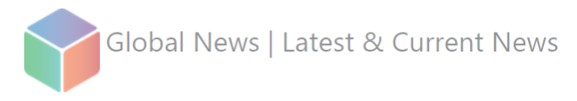
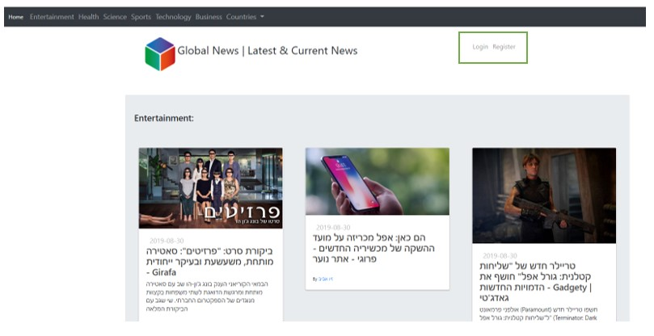
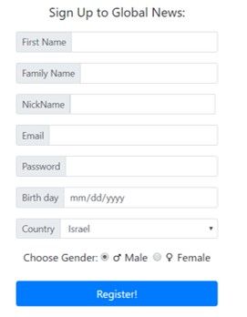
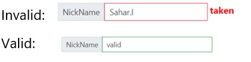
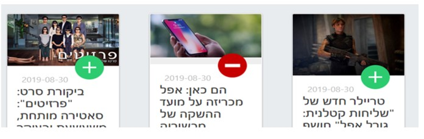
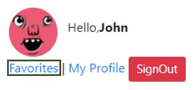
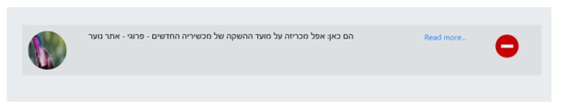
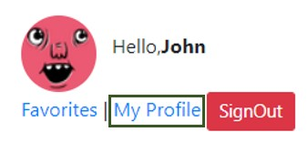
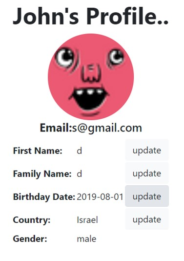

Welcome to **Global News** documentation. the documentation has been written in English and Hebrew. The Hebrew version can be found below.

English documentation:
	Thank you for choosing to use **Global News** site. **Global News** allow you to view news based on the country of your choosing as well as marking them for later viewing. **Global News** does not write the news, rather it mediates between customers and the many news sites.

Let's look at the homepage:

**Global News** shows top headlines for each category based on the user country. If the user is not logged-in, the default is Israel("il").
In the marked green square, you can register or login to the site.

On the top of the page you can choose any category or a country you want.
Categories – news based on user country.
Countries – top headlines of the chosen country.

Now let's sign up:

The Registration is simple and standard. If you fill something wrong and try to register, you will see error below the page.

The news you will see are based on the country you chose (don’t worry you can change it later).

Important thing to note, the nickname is unique. It cannot be used for two different users. If the nickname you chose is taken you will see taken on the right. Otherwise, the border will change to green:

Once you signed up, you will see next to each article the "Favorite" button (+/-). Favorite button allows you to add or remove article even if you're not on the Favorites page.
Example:

The middle article has been favored by you. The article is in your favorites list. You can now remove it from the list by clicking the "Favorite" button again.

Now go to favorites page:

In favorites page you can see all the news you saved. Now you can read them or remove then whenever you want.

Now go to 'My Profile' page:

In this page you can update your information. Remember, the articles are based on your chosen country.

תיעוד בשפה העברית:
תודה שבחרת להשתמש באתרנו "Global News". באתר תוכלו לצפות בכתבות לפי מדינתכם. תוכלו למצוא כתבות מתחומים שונים כמו בידור, ספורט, כלכלה
 וכו' .  "Global News" מגשר בין הלקוחות לבין אתרי החדשות, ואינו כותב את התוכן בעצמו.

תכנסו לדף הבית:

"Global News" מראה כתבות שפורסמו לאחרונה לקטגוריות השונות לפי המדינה שבחר המשתמש. אם אין אף משתמש שמחובר, ברירת המחדל היא מדינת ישראל.
במלבן הירוק אפשר לבצע התחברות/ הרשמה לאתר.

בחלק העליון של הדף תוכלו לבחור קטגוריה או מדינה שתרצו.
קטגוריות – חדשות לפי מדינת המשתמש.
ארצות – כתבות פופולריות לפי המדינה שבחרת.

נבצע הרשמה לאתר:

ההרשמה פשוטה וסטנדרטית. אם אחת מהשדות אינה נכונה, תופיע שגיאה בתחתית הדף.
החדשות שתראה מתבססות על המדינה שתבחר(אל תדאג, תוכל לשנות זאת בהמשך).

דבר חשוב! הכינוי הוא ייחודי. כינוי אינו יכול להיבחר ע"י שני משתמשים שונים. אם הכינוי שבחרת תפוס יופיע taken. אחרת, הגבול של השדה יסומן בירוק:

לאחר ההרשמה, תוכלו לראות ליד כל כתבה את כפתור המועדפים(+/-).
בלחיצה על כפתור זה תוכל להוסיף או להסיר כתבה מרשימת המועדפים שלך גם שאתה לא נמצא בדף המועדפים.
לדוגמא:

הכתבה האמצעית נמצאת כרגע אצלך במועדפים. תוכל להסיר את הכתבה בעזרת לחיצה נוספת על כפתור המועדפים.
לך לעמוד המועדפים:

בעמוד המועדפים אתה יכול לראות את כל הכתבות שסימנת. עכשיו תוכל לקרוא או להסיר אותם מתי שתרצה.
 

עכשיו, לך לעמוד "הפרופיל שלי":
 

בדף זה, תוכל לעדכן את הפרטים האישיים שלך כמו שם אישי, שם משפחה וכו' . זכור, הכתבות שתראה באתר הן על בסיס המדינה שבחרת בפרופיל.
 

תודה רבה וגלישה נעימה.
